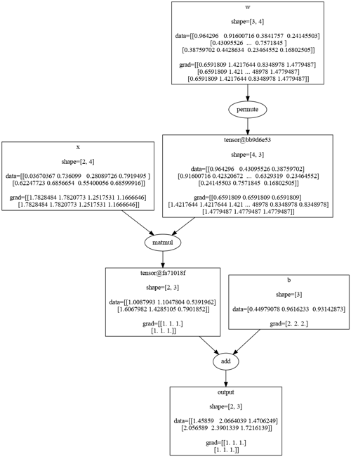

# About
tensorgrad is a tiny library capable of training deep neural networks on both cpu and cuda devices.  

Its designed exactly like PyTorch, depends only on NumPy and implements over 60 differentiable tensor operations within 2k lines of code.

# Why?
*Why bothering with yet another neural network framework?*  

Indeed, there is no need.  
tensorgrad was never meant to be an actual kind of production-ready framework to train and infer models.  

tensorgrad is solely an **educational** project with the main purpose of diving deep into machinery of tensor computation and vectorized backpropagation.  
Also it was quite fun to explore and reproduce PyTorch design.  


Needless to say that tensorgrad should not be used to actually train your models.  
Yet tensorgrad may appear useful if you are looking for a super lightweight inference on cpu.  
While depending only on NumPy tensorgrad will provide decent inference runtime for networks of moderate size.  

Another case in which tensorgrad is useful is learning.  
If you are trying to learn and understand machinery of vectorized backpropagation (as I did) it may appear helpful to have a look at tensorgrad implementations.  
The code is fairly transparent, highly decomposed and there is not much of it in the first place.  
If you are only interested in gradient computation have a look at backward methods of ops in `tensorgrad/ops/np`.  
In most of the implementations `u` is the upstream gradient while `g` is the local gradient (or sometimes downstream).  

# Like PyTorch
tensorgrad is designed exactly like PyTorch and implements the same API.  
You will find familiar `tensorgrad.tensor` API and such modules as `tensorgrad.nn` and `tensorgrad.optim`.  

Check out this example of learning XOR function.  
*Also you may drop-in replace tensorgrad with PyTorch (and vice-versa) by replacing first line with `import torch as tensorgrad`.*

```python
import tensorgrad

# define training data and place it on device.
device = 'cpu'
x = [
    [0, 0],
    [0, 1],
    [1, 0],
    [1, 1],
]
y = [1, 0, 0, 1]
x = tensorgrad.tensor(x, requires_grad=False).float().to(device)
y = tensorgrad.tensor(y, requires_grad=False).long().to(device)

# define model, loss function and optimizer and place them on device.
model = tensorgrad.nn.Sequential(
    tensorgrad.nn.Linear(2, 8),
    tensorgrad.nn.ReLU(),
    tensorgrad.nn.Linear(8, 2),
)
model.to(device)
model.train()
optim = tensorgrad.optim.SGD(model.parameters(), lr=0.5)
loss_fn = tensorgrad.nn.CrossEntropyLoss()

# train model for 5k steps.
steps = 5000
for step in range(steps):
    optim.zero_grad()
    outputs = model(x)
    loss = loss_fn(outputs, y)
    loss.backward()
    optim.step()

# run inference on train data.
model.eval()
with tensorgrad.no_grad():
    logits = model(x)
    softmax = logits.softmax(-1).numpy()
    pred = softmax.argmax(-1)
    targets = y.numpy()

# print targets, prediction and softmax output.
print(f'targets: {targets}')
print(f'prediction: {pred}')
print(f'softmax:')
print(softmax)

```
```bash
targets: [1 0 0 1]
prediction: [1 0 0 1]
softmax:
[[1.0019985e-03 9.9899799e-01]
 [9.9988753e-01 1.1248640e-04]
 [9.9986255e-01 1.3741938e-04]
 [8.7526947e-05 9.9991244e-01]]
```

# Features
- Fully fledged tensor library supporting autograd with only single dependency on NumPy
- Capable of training common deep neural networks
- Implements 63 differentiable tensor operations and 18 neural network modules
- Follows PyTorch API being its drop-in replacement
- Runs on both cpu and cuda devices
- Fully vectorized computation without any native Python loops  
- Computational graph rendering
- Exhaustive tests against PyTorch  

# Examples
Here are few examples of training small networks with tensorgrad

## XOR
Learning to solve XOR function with single hidden layer.  
The script will train the model and print out inference results.  

Command: ```python -m examples.xor```  

## MNIST ConvNet
Solving subset of MNIST with tiny convnet.  
The model is defined in `examples/mnist/cnn/model.py`.  
This model hits almost 100% accuracy pretty quick.  
The script will train the model and print out test accuracy.  

Command:  `python -m examples.mnist.cnn.train`  
Parameters:  
```bash
optional arguments:
  -h, --help            show this help message and exit
  --device DEVICE       device to train on (default: cpu)
  --epochs EPOCHS       number of epochs (default: 20)
  --batch_size BATCH_SIZE
                        batch size (default: 32)
  --truncate_train TRUNCATE_TRAIN
                        number of training samples (default: 10000)
  --truncate_test TRUNCATE_TEST
                        number of test samples (default: 1000)
```

## MNIST ViT
Solving subset of MNIST with tiny vision transformer.  
The transformer operates on 4x4 patches and has dimensionality 128, 2 attention heads and single encoder layer.  
Its defined in `examples/mnist/vit/model.py`.  
This model surpasses 90% accuracy pretty quick but then a bit stalls.  
Probably it should be trained for longer than convnet and lr routine should be adjusted.  
The script will train the model and print out test accuracy.  

Command:  `python -m examples.mnist.vit.train`  
Parameters:  
```bash
optional arguments:
  -h, --help            show this help message and exit
  --device DEVICE       device to train on (default: cpu)
  --epochs EPOCHS       number of epochs (default: 20)
  --batch_size BATCH_SIZE
                        batch size (default: 32)
  --truncate_train TRUNCATE_TRAIN
                        number of training samples (default: 10000)
  --truncate_test TRUNCATE_TEST
                        number of test samples (default: 1000)
  --patch_size PATCH_SIZE
                        ViT patch size (default: 4)
  --embed EMBED         ViT embedding dimensionality (d_model) (default: 128)
  --num_heads NUM_HEADS
                        ViT number of attention heads per single encoder layer (default: 2)
  --num_layers NUM_LAYERS
                        ViT number of encoder layers (default: 1)
```

# Modules
tensorgrad implements a bunch of common neural network modules available in `tensorgrad.nn` module.  
For example Linear, Conv2d, MultiheadAttention, BatchNorm and other.  
See `DOCS.md` for a full list and API reference.  

Each module is fully compatible with its PyTorch analogue and may be initialized from the latter by calling `init_from_torch(torch_module)`.  
All modules support both cpu and cuda devices with float32 dtype.

# Implementation
At the highest level tensorgrad roughly does this:  
1. Wraps specific multi-dimensional array implementation with `tensorgrad.tensor`  
2. Leverages this implementation to define forward and backward computation  
3. Dynamically dispatches op calls in runtime  
4. Captures and maintains the computational graph  
5. Traverses the graph forwards and backwards  

Under the hood tensorgrad is built off the following main concepts:  
- `Storage:` implementation of multi-dimensional array on a particular device  
- `Op:` implementation of forward and backward for a particular storage  
- `Autograd:` engine which captures all tensor ops and maintains the computational graph  
- `Dispatch`: dispatcher which executes tensor ops in runtime and supports autograd machinery  

Storage provides implementation of the multi-dimensional array and all of its ntive ops. This implementation is then used by tensorgrad ops which implement forward and backward computation. A dispatcher then registers each tensorgrad op. In runtime the dispatcher handles op calls and routes them to appropriate tensorgrad op implementations. Finally the dispatcher handles all the neccessary autograd stuff.  

Cpu storage and ops are powered by NumPy while CuPy powers cuda ones. Its worth noting that cpu and cuda ops share the same implementation thanks to interoperability between NumPy and CuPy.

# Efficiency
Under the hood tensorgrad uses vectorized NumPy code to implement cpu device and CuPy code to implement cuda device. In theory this makes tensorgrad fairly fast on both devices. However on average tensorgrad on cpu is roughly 10x slower than PyTorch on cpu. Detailed benchmarks are listed in `BENCHMARK.md`. On the other side tensorgrad is significantly faster than naive loop-based implementations (even numba-jit compiled ones).  

I guess there are at least two reasons behind such a slowdown compared to PyTorch. Firstly, of course its a skill issue. In theory one may implement an op with NumPy faster than tensorgrad does. Secondly, its the limits of the NumPy nature. You cant just go out there and throw in a nice kernel running your for loops natively compiled optimized and parallelized. You kinda have to get away with general purpose stuff NumPy offers and try to tailor it to your needs. Of course for some cases its works great. That would typically be the case with generic ops like binary ops, matmul, reshapes and etc. On the contrary, when dealing with other more complicated ops such as conv2d or max_pool2d you really start to feel those limits which force you to dig deep into any possible tricks and workarounds which introduce overhead.  

Finally, one may notice terribly slow backward of softmax in tensorgrad. The reason is that in backward I have to compute full jacobian of the softmax because I could not come up with a more efficient vectorized implementation in the general purpose case. Yes a trivial gradient exists for softmax followed by cross-entropy loss but I'm not talking such a case. I'm talking about general purpose softmax such as in multihead attention for example.

# CUDA
CUDA device implementation is powered by CuPy. tensorgrad tries to dispatch as much work to CuPy as possible. However due to the requirement of interoperability with NumPy some cuda ops (like conv2d) may be implemented not in the fastest way possible with a lot of overhead. On large enough volumes of data tensorgrad on cuda is roughly 10x faster than PyTorch on cpu (see `BENCHMARK.md` for details). There are no benchmarks against PyTorch on cuda because I would not like to introduce such a heavyweight dev dependency as torch-cuda.  

Efficiency of cuda ops correlates with their generic-ness. Generic ops run really fast approaching CuPy peak performance. These include binary ops and matmul. Specific ops such as max_pool2d or softmax suffer from significant overhead because of a load of tricks and workarounds in their implementation.  

Finally, tensorgrad achieves overall pretty low cuda device usage. Average usage is around 10% while training models. Yet I must say that training is single threaded and tensorgrad has zero optimizations related to cuda workflow which introduces unneccessary copies and transfers. In fact cpu and cuda ops in tensorgrad are the same entity because they share the same implementation. Its the array interface implementation that effectively runs the code on the device. tensorgrad always does some constant work to get down there so there will always be constant overhead no matter which device is used. Anyways its obvoius that there remains plenty of work to do to improve overall device usage.  

# Tests
tensorgrad is thoroughly tested against PyTorch as the ground truth. Each op is tested with various setups for correctness of forward and backward computation. Built-in unittest is used as testing framework.

Following tests are available:  
- `tests/test_ops.py:` tests of tensor ops' forward and backward implementation  
- `tests/test_nn.py:` tests of nn modules' forward and backward implementation  
- `tests/test_optim.py:` tests of optimization algorithms  
- `tests/test_train.py:` tests of training behavior (trains couple of tiny networks for a small amount of steps)  

Here is how to launch tests:   
- `python -m unittest -v <test_file.py>:` launches tests defined in `<test_file.py>` in verbose mode  
- `python -m unittest -v tests/test_ops.py:` launches tensor ops' tests defined in `tests/test_ops.py`  
- `VERBOSE=1 python -m unittest -v tests/test_train.py:` launches training tests and logs training losses for each step
- `python -m unittest discover -v tests:` launches all tests at once. however in this scenario training tests may somehow fail due to precision issues for yet unknown reason. when launched directly training tests never fail. hmmm...

Each of the test suites may be run on both cpu and cuda devices via setting `DEVICE` env variable. By default all tests run on cpu device but launching with `DEVICE=cuda` env variable will run the tests on cuda device.  
For example is how to run nn modules' tests on cuda device: `DEVICE=cuda python -m unittest -v tests/test_nn.py`

Obviously PyTorch is required installed to run tests.  
I recommend installing cpu-only build of torch which significantly lighter than default one including cuda bindings.  
In all the tests PyTorch always runs on cpu device even if tensorgrad runs on cuda via `DEVICE=cuda`.  
Also `parameterized` package is required.

# Documentation
Full documentation and API reference is available in `DOCS.md`

# Installation
tensorgrad is meant to be used as a project rather than a library. That's why there is no `setup.py`.  

The project was built with Python3.8 on a linux machine. Instructions below also assume running on a linux machine. However, in theory, other platforms should also be supported without any extra effort.

## cpu-only
1. clone the repo
2. `pip install numpy`
## cpu and cuda
1. clone the repo
2. `pip install numpy`
3. `pip install cupy-cuda11x` (see CuPy's original install instructions to adapt your cuda version)
## tests
1. clone the repo
2. `pip install numpy`
3. `pip install cupy-cuda11x` (see CuPy's original install instructions to adapt your cuda version)
4. `pip install torch --index-url https://download.pytorch.org/whl/cpu` (cpu-only build of PyTorch)
5. `pip install parameterized`

# Computational Graph
tensorgrad is capable of executing and differentiating arbitrary computational graphs. All tensor ops executed are automatically captured onto the graph. Then its possible to back-propagate and visualize the graph starting from any node.  

Below is the visualization of computing linear function.  
Command: `python -m examples.graph`  



Note that visualization requires installed packages `Pillow` and `graphviz` as well as `graphviz` binary

# Extensions
tensorgrad was specifically designed to be backend agnostic. Its fairly easy to implement a new device. That would require implementing a storage living on that device and a set ops knowing how to do some math on that data

## Storage implementation
Storage must be implemented as a class following interface `tensorgrad.storage.stubs.Storage`. Actual array implementation does not matter as its assumed that ops are responsible to encapsulate operating on the array implementation. 

## Op implementation
An op implementation must follow interface `tensorgrad.ops.stubs.Op` defining both forward and backward passes. It should encapsulate specifics of the device and its array implementation. For example, NumPy ops leverage NumPy array interface but no piece of code outside NumPy ops ever knows about it.  

Having op implementation done, it further needs to be registered under the device name. After that the dispatcher would be able to execute the op on the device. Use `tensorgrad.ops.dispatch.OpDispatch.register` as a class decorator to register your op passing name and device as parameters. Op names and device names are provided by `tensorgrad.const.OP` and `tensorgrad.const.DEVICE` enums.  

Finally, a device need not to implement all the ops possible. Its fine to implement any desired number of ops as long as they are registered to the dispatcher. For example, one may accelerate only conv2d with custom cuda kernel. That would require implementing a storage and a Conv2d op.
